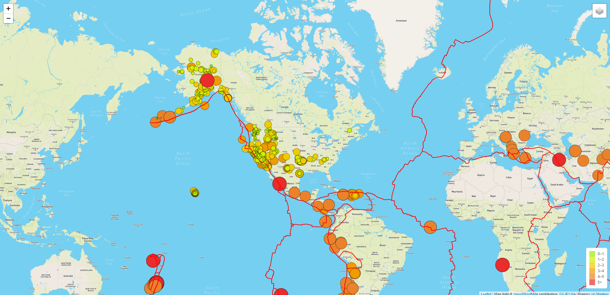

# Mapping_Earthquakes

This project pulls from USGS JSONs to depict the last week's earthquakes. It uses mapbox and leaflet to depict the maps and quake events and allow for some customization in display vis a vis different layers (tectonic plates, all quakes, major quakes only) and map backdrops.

